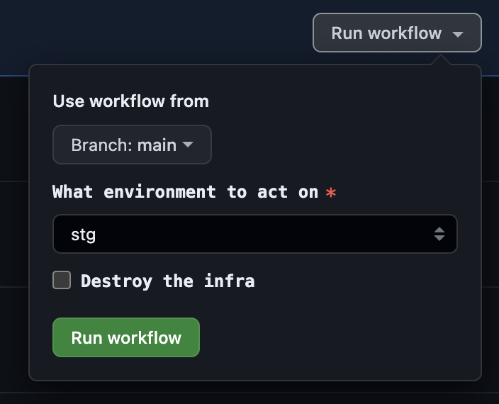

# Deploy to AWS

## Automation via GitHub Actions
A push to master will trigger infrastructure deployment to AWS using Github acitons defined in [apply.yml](.github/workflows/apply.yml)

Also its possible to trigger the deployment manually using [Github Actions](https://github.com/aaalexlit/capitalbikeshare-service-terraform/actions/workflows/apply.yml)



If the "Destroy the infra" option is selected the infra will be destroyed instead of applying the changes

## Manual deployment to AWS from local
To deploy to AWS from local manually follow the [create-aws-infra.sh](create-aws-infra.sh) script

# Local development
to make localstack work with terraform we need to use `terraform-local`
more info here
https://docs.localstack.cloud/user-guide/integrations/terraform/

Also, for convenience we'll install `awslocal` command  
https://docs.localstack.cloud/user-guide/integrations/aws-cli/

Conda environment created in the [main repo](https://github.com/aaalexlit/capitalbikeshare-mlops) needs to be activated (eg it has pipenv already installed and uses a proper python version):

```shell
conda activate capitalbikeshare-mlops
```

To have both `tflocal` and `awslocal` available:
```shell
pipenv install
pipenv shell
```

To test everything locally you can just run 
**Important**
For this to run you need to have a docker image `capitalbikeshare-service-prediction-service:latest` defined in the [service repo](https://github.com/aaalexlit/capitalbikeshare-service) built locally  
Also make sure that the port 80 is available

```shell
./test-infra.sh
```

It will execute all the following steps:

To be able to use localstack-pro image that supports ECR and ECS one needs to sign up for
localstack free trial and have an environment variable `LOCALSTACK_API_KEY` set.
On Mac/Linux:
```shell
export LOCALSTACK_API_KEY=<your_localstack_api_key>
```
Then we need to spin up container with localstack

```shell
docker compose up -d
```

First we need to make a bucket manually to hold the tfstate

Make bucket
```shell
awslocal s3 mb s3://terraform-state-mlops-zoomcamp
```

Check that the bucket is there just in case
```shell
awslocal s3 ls
```

Export environment name that we wish to work with. For instance, `stg`

```shell
export TF_ENV="stg"
```
To init tflocal with the corresponding s3 backend configuration (for staging/prod)
Eg the following will do the init with the staging backend
```shell
tflocal init -reconfigure -backend-config=environments/${TF_ENV}/backend.config
```

First we need to create only ECR repo to be able to push an image
```shell
tflocal plan -target=aws_ecr_repository.prediction_service_ecr_repo -var-file="environments/${TF_ENV}/environment.tfvars" -out=ecr_repo.tfplan
tflocal apply ecr_repo.tfplan
```


Tag existing image (built in the other repo) and push to the ECR
```shell
image_name_with_tag="$(tflocal output -raw ecr_repository_url):latest"
docker tag capitalbikeshare-service-prediction-service:latest $image_name_with_tag
docker push $image_name_with_tag
```

See the plan
```shell
tflocal plan -var-file="environments/${TF_ENV}/environment.tfvars"
```

Apply (needs confirmation)

```shell
tflocal apply -var-file="environments/${TF_ENV}/environment.tfvars"
```

Run healthcheck
```shell
curl http://localhost/healthcheck
```

Run prediction
```shell
curl -X POST http://localhost/predict -H "Content-Type: application/json" -d '{"start_station_id": "31205","end_station_id": "31239","rideable_type": "docked_bike","member_casual": "member","started_at": "2020-04-06 07:54:59"}'

```

Destroy (needs confirmation)

```shell
tflocal destroy -var-file="environments/${TF_ENV}/environment.tfvars"
```


<!-- BEGIN_TF_DOCS -->
## Requirements

The following requirements are needed by this module:

- <a name="requirement_terraform"></a> [terraform](#requirement\_terraform) (>= 1.5)

- <a name="requirement_aws"></a> [aws](#requirement\_aws) (~> 5.9)

## Providers

The following providers are used by this module:

- <a name="provider_aws"></a> [aws](#provider\_aws) (5.13.1)

## Resources

The following resources are used by this module:

- [aws_alb.application_load_balancer](https://registry.terraform.io/providers/hashicorp/aws/latest/docs/resources/alb) (resource)
- [aws_default_subnet.default_subnet_a](https://registry.terraform.io/providers/hashicorp/aws/latest/docs/resources/default_subnet) (resource)
- [aws_default_subnet.default_subnet_b](https://registry.terraform.io/providers/hashicorp/aws/latest/docs/resources/default_subnet) (resource)
- [aws_default_vpc.default_vpc](https://registry.terraform.io/providers/hashicorp/aws/latest/docs/resources/default_vpc) (resource)
- [aws_ecr_repository.prediction_service_ecr_repo](https://registry.terraform.io/providers/hashicorp/aws/latest/docs/resources/ecr_repository) (resource)
- [aws_ecs_cluster.ecs_cluster](https://registry.terraform.io/providers/hashicorp/aws/latest/docs/resources/ecs_cluster) (resource)
- [aws_ecs_service.app_service](https://registry.terraform.io/providers/hashicorp/aws/latest/docs/resources/ecs_service) (resource)
- [aws_ecs_task_definition.service_task](https://registry.terraform.io/providers/hashicorp/aws/latest/docs/resources/ecs_task_definition) (resource)
- [aws_iam_role.ecsTaskExecutionRole](https://registry.terraform.io/providers/hashicorp/aws/latest/docs/resources/iam_role) (resource)
- [aws_iam_role_policy_attachment.ecsTaskExecutionRole_policy](https://registry.terraform.io/providers/hashicorp/aws/latest/docs/resources/iam_role_policy_attachment) (resource)
- [aws_lb_listener.listener](https://registry.terraform.io/providers/hashicorp/aws/latest/docs/resources/lb_listener) (resource)
- [aws_lb_target_group.target_group](https://registry.terraform.io/providers/hashicorp/aws/latest/docs/resources/lb_target_group) (resource)
- [aws_security_group.load_balancer_security_group](https://registry.terraform.io/providers/hashicorp/aws/latest/docs/resources/security_group) (resource)
- [aws_security_group.service_security_group](https://registry.terraform.io/providers/hashicorp/aws/latest/docs/resources/security_group) (resource)

## Required Inputs

The following input variables are required:

### <a name="input_cpu"></a> [cpu](#input\_cpu)

Description: ECS CPU to set to the tasks.

Type: `number`

### <a name="input_desired_count"></a> [desired\_count](#input\_desired\_count)

Description: How many ECS Tasks to initialy deploy per service.

Type: `number`

### <a name="input_environment"></a> [environment](#input\_environment)

Description: Environment name

Type: `string`

### <a name="input_memory"></a> [memory](#input\_memory)

Description: ECS memory to set to the tasks.

Type: `number`

### <a name="input_region"></a> [region](#input\_region)

Description: AWS Region where to create the resources.

Type: `string`

## Optional Inputs

The following input variables are optional (have default values):

### <a name="input_ecr_repo_name"></a> [ecr\_repo\_name](#input\_ecr\_repo\_name)

Description: ECR repo name

Type: `string`

Default: `"capitalbikeshare-dv-model-pipeline"`

## Outputs

The following outputs are exported:

### <a name="output_app_url"></a> [app\_url](#output\_app\_url)

Description: Log the load balancer app url

### <a name="output_container_name"></a> [container\_name](#output\_container\_name)

Description: n/a

### <a name="output_ecr_repository_url"></a> [ecr\_repository\_url](#output\_ecr\_repository\_url)

Description: n/a

### <a name="output_ecs_cluster"></a> [ecs\_cluster](#output\_ecs\_cluster)

Description: n/a

### <a name="output_ecs_service"></a> [ecs\_service](#output\_ecs\_service)

Description: n/a

### <a name="output_task_definition_json"></a> [task\_definition\_json](#output\_task\_definition\_json)

Description: n/a
<!-- END_TF_DOCS -->